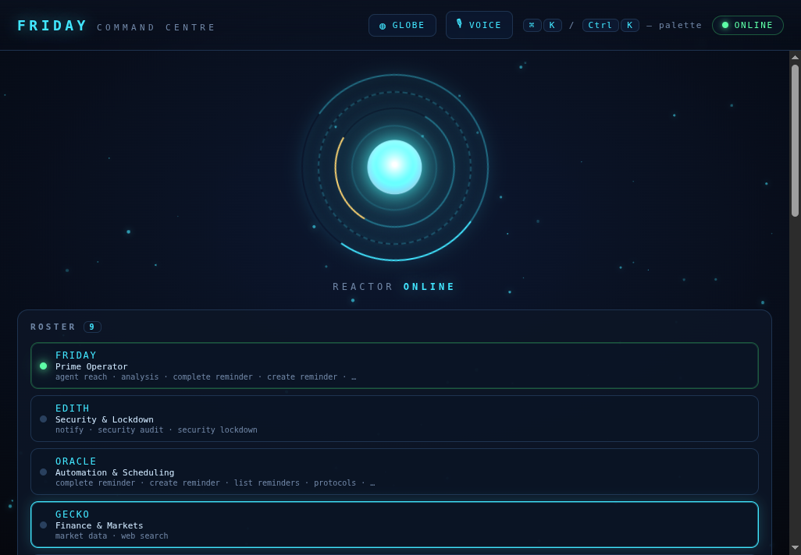
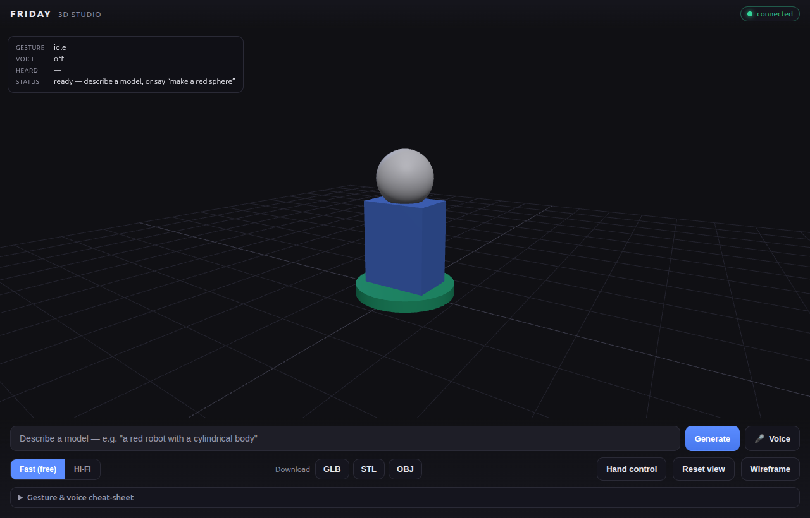

<!-- Screenshots referenced below (assets/screenshots/*.png) are added post-build; the relative paths are stable and the images drop in later. -->

<div align="center">

# 🛰️ FRIDAY

### A local-first personal AI operating system — not a chatbot, an OS.

[](https://www.python.org/)
[](#-quality)
[](#-quality)
[](https://github.com/astral-sh/ruff)
[](#)
[](#-what-it-is)
[](#-the-brain)

</div>

---

<div align="center">

## 📸 Gallery

<table>
  <tr>
    <td align="center" width="50%">
      <br>
      <sub><b>Command Centre HUD</b> — the arc-reactor cockpit: live roster, routing traces, audit & flags</sub>
    </td>
    <td align="center" width="50%">
      <br>
      <sub><b>3D Studio</b> — describe a model, explore it by hand &amp; voice, export GLB/STL/OBJ</sub>
    </td>
  </tr>
</table>

</div>

---

## ✨ What it is

FRIDAY is a **local-first, provider-abstracted personal AI operating system** you run on
your own machine. It is deliberately *not* a chatbot wrapper: a deterministic orchestrator
classifies every turn, hands it to a **roster of named specialist operators**, and routes
every side effect through a **fail-closed security broker** that injects secrets, enforces
permissions, and writes a **hash-chained, tamper-evident audit ledger**.

- 🏠 **Local-first** — runs on your machine; nothing phones home unless you point it at a
  real provider on purpose.
- 🔌 **100% provider-abstracted** — the language model sits behind a clean seam. A built-in
  `FakeLLM` keeps the whole system (and its **1348 tests**) green with zero network and no
  keys; swap in NVIDIA NIM or Gemini when you want real replies.
- 🧱 **Flag-gated by default** — every non-core capability is behind a `FRIDAY_ENABLE_*`
  flag, **default off**. The core boots tiny and dependency-light; you light up surfaces as
  you need them.
- 🧾 **Honest by construction** — no fabricated data. When a backend is unreachable, FRIDAY
  tells you plainly instead of inventing an answer.

---

## 🧠 The brain

A deterministic router classifies each turn into a conversation **mode** (`CONVERSATION`,
`RESEARCH`, `AUTOMATION`, `DEVICE_CONTROL`, `ALERTING`, `SECURITY_LOCKDOWN`, `CLARIFY`, …)
*before* any model call — so routing is populated even when the language backend is down.
The orchestrator then delegates to an **8-persona roster** of least-privilege specialists,
each owning a distinct slice of the tool surface and its own memory namespace.

| Operator | Title | Owns |
|---|---|---|
| 🛰️ **FRIDAY** *(prime)* | Prime Operator | The broad union of every specialist — delegates or stands in for any of them |
| 🛡️ **EDITH** | Security & Lockdown | Owner-scoped defensive lockdown, security audit, notify |
| ⏱️ **ORACLE** | Automation & Scheduling | Scheduler, protocols, reminders |
| 📈 **GECKO** | Finance & Markets | Market data, web research |
| ✉️ **KAREN** | Communications | Notify, email, agent outreach |
| ✍️ **VERONICA** | Content & Outreach | Web research, agent outreach |
| 📚 **JOCASTA** | Memory & Knowledge | Knowledge base, RAG, knowledge graph |
| 🔭 **VISION** | Research & Analysis | Analysis, web search, agent outreach |
| 🔧 **FORGE** | Development & System | Run commands, find files, open apps, home/device control |

Personas are **pure data** — a title, a frozen tool allow-list, a memory namespace, and a
system prompt — so the prime's scope is *computed* as the union of the specialists and can
never drift out of sync. Inspect the live roster with `friday roster`.

> **The provider seam.** The orchestrator depends only on an `LLMProvider` abstraction — it
> imports *no* model SDK. NVIDIA NIM powers real replies, Gemini is an optional fallback,
> and `FakeLLM` is the deterministic offline default. The agent layer is grep-enforced clean
> of provider SDKs.

---

## 🔒 Security

Every action FRIDAY takes — read-only or side-effecting — flows through the **Broker**, a
single fail-closed gate. Nothing reaches a tool without passing the pipeline:

```
raw intent
   │
   ▼
1. VALIDATE   ── coerce args through the tool's typed model · reject bad args before any effect
2. CLASSIFY   ── derive reversibility (side-effecting & not idempotent ⇒ irreversible)
3. GATE       ── deny-by-default · unknown tool ⇒ denied · irreversible & unconfirmed ⇒ needs_confirmation
4. INJECT     ── replace {{secret:NAME}} markers with real secrets at call time (never returned, never logged)
5. EXECUTE    ── run via the injected tool registry
6. AUDIT      ── append ONE hash-chained record (redacted args, decision, outcome, actor, channel)
   │
   ▼
tamper-evident ledger
```

- **Fail-closed gate** — deny-by-default. A tool absent from the allow-list is denied; an
  irreversible action without explicit `confirmed=true` is held for confirmation. The tool
  never runs on either path.
- **Secret injection** — arguments of the exact form `{{secret:NAME}}` are resolved from the
  vault *at call time*. The resolved value is passed to the tool but **never** returned in a
  result and **never** written to the audit — the ledger records the marker, not the secret.
- **Hash-chained audit** — each ledger entry's hash is `sha256(prev_hash + canonical_json(record))`,
  binding it to its predecessor. `verify` walks the chain and pinpoints the first tampered,
  deleted, or forged link. Sensitive keys are redacted *before* hashing. Verify any time with
  `friday audit verify` or `GET /admin/audit/verify`.
- **OS-keystore secrets** — secrets live behind a vault protocol with a `KeyringVault` backend
  (your OS keychain), with `EnvVault` / `FileVault` (0600) / `MemoryVault` fallbacks. Secret
  fields are typed `SecretStr` and redacted from logs.
- **SDK isolation** — the agent layer imports no provider SDKs (grep-enforced), and the
  outbound `agent-reach` CLI runs as an isolated subprocess with a clear install hint and no
  fabricated output on failure.

---

## 🧩 Capabilities

Around 40 capabilities, every one behind a `FRIDAY_ENABLE_*` flag (**default off**), grouped
by domain. The core chat/route/memory/broker loop is always on.

<details>
<summary><b>📖 Click to expand the full capability table</b></summary>

### 🧱 Core

| Capability | What it does | Flag |
|---|---|---|
| Action Broker | Fail-closed validate → classify → gate → inject → execute → audit pipeline | `FRIDAY_ENABLE_BROKER` |
| Agent reach | Reach other agents via an isolated outbound CLI subprocess | `FRIDAY_ENABLE_AGENT_REACH` |
| Extra tools | Optional extended tool surface beyond the core registry | `FRIDAY_ENABLE_EXTRA_TOOLS` |
| Plugins | Load drop-in capability plugins | `FRIDAY_ENABLE_PLUGINS` |
| Offline mode | Force the fully offline path (fake providers, no network) | `FRIDAY_ENABLE_OFFLINE_MODE` |
| Self-critique | A reflective self-critique pass on responses | `FRIDAY_ENABLE_SELF_CRITIQUE` |

### 🧠 Memory

| Capability | What it does | Flag |
|---|---|---|
| Knowledge graph | Extract entities/relations into a traversable graph | `FRIDAY_ENABLE_KNOWLEDGE_GRAPH` |
| RAG | Ingest documents and answer grounded from them | `FRIDAY_ENABLE_RAG` |
| Journal | Build and query a personal journal | `FRIDAY_ENABLE_JOURNAL` |
| Study | Spaced-repetition cards, review sessions | `FRIDAY_ENABLE_STUDY` |
| Postgres | Use Postgres for persistent memory instead of SQLite | `FRIDAY_ENABLE_POSTGRES` |

### 🎙️ Voice

| Capability | What it does | Flag |
|---|---|---|
| Voice pipeline | Wake word → Whisper STT → orchestrator → TTS, with barge-in | `FRIDAY_ENABLE_VOICE` |
| Voiceprint | Speaker verification on the voice path | `FRIDAY_ENABLE_VOICEPRINT` |

### 🧊 3D Studio

| Capability | What it does | Flag |
|---|---|---|
| 3D Studio | Describe a model by text/voice, explore by hand gesture & voice, export GLB/STL/OBJ | `FRIDAY_ENABLE_STUDIO` |

### 👁️ Vision

| Capability | What it does | Flag |
|---|---|---|
| Perception | YOLO detection, OCR, clipboard, screen capture → `describe_screen()` *(privacy-heavy)* | `FRIDAY_ENABLE_PERCEPTION` |

### 📡 Proactive

| Capability | What it does | Flag |
|---|---|---|
| Proactive | FRIDAY initiates without being prompted | `FRIDAY_ENABLE_PROACTIVE` |
| Scheduler | Time-based job scheduling | `FRIDAY_ENABLE_SCHEDULER` |
| Protocols | Multi-step named protocols / routines | `FRIDAY_ENABLE_PROTOCOLS` |
| Reminders | Create, list, complete reminders | `FRIDAY_ENABLE_REMINDERS` |
| Briefing | Generate a rolled-up briefing | `FRIDAY_ENABLE_BRIEFING` |
| Presence | MAC-based presence / known-device detection | `FRIDAY_ENABLE_PRESENCE` |
| Meetings | Capture and summarize meetings | `FRIDAY_ENABLE_MEETINGS` |

### 🔌 Integrations

| Capability | What it does | Flag |
|---|---|---|
| Maps | Google Maps directions / places / geocoding | `FRIDAY_ENABLE_MAPS` |
| Market data | Live quotes & holdings via the Dhan broker API | `FRIDAY_ENABLE_MARKET_DATA` |
| Calendar | Google Calendar events | `FRIDAY_ENABLE_CALENDAR` |
| Email | Gmail read / send | `FRIDAY_ENABLE_EMAIL` |
| Comms | SMS / WhatsApp via Twilio | `FRIDAY_ENABLE_COMMS` |
| n8n | Draft and start n8n workflows behind a confirm-step | `FRIDAY_ENABLE_N8N` |
| Family sharing | Opt-in, revocable sharing with family | `FRIDAY_ENABLE_FAMILY_SHARING` |
| Home | Home/device controls | `FRIDAY_ENABLE_HOME` |
| Media control | Control media playback | `FRIDAY_ENABLE_MEDIA_CONTROL` |
| Downloads butler | Tidy and organize the downloads folder | `FRIDAY_ENABLE_DOWNLOADS_BUTLER` |

### 🛠️ Ops

| Capability | What it does | Flag |
|---|---|---|
| HUD | The Command Centre heads-up surface | `FRIDAY_ENABLE_HUD` |
| Desktop | Desktop automation surface | `FRIDAY_ENABLE_DESKTOP` |
| System automation | Drive system-level automation | `FRIDAY_ENABLE_SYSTEM_AUTOMATION` |
| System monitor | Live system stats & health checks | `FRIDAY_ENABLE_SYSTEM_MONITOR` |
| Secret self-check | Scan for plaintext secrets at startup | `FRIDAY_ENABLE_SECRET_SELF_CHECK` |

</details>

> Don't see a surface you enabled? Its routes return `404` while the flag is off — that's the
> gate working, not a bug. Flip the flag and restart.

---

## 🚀 Quickstart

**Requirements:** Python **3.12+** and [uv](https://docs.astral.sh/uv/).

```bash
make install            # uv sync --all-groups  — venv + everything core
cp .env.example .env    # then edit: pick a provider, set keys you want
make run                # uv run uvicorn friday.app:create_app --factory --reload
```

That serves the app on `http://127.0.0.1:8000`. Sanity-check it (no LLM call):

```bash
curl -s http://127.0.0.1:8000/health
# {"status":"ok","llm_provider":"fake","model":null}
```

Send it a turn:

```bash
curl -s -X POST http://127.0.0.1:8000/chat \
  -H 'content-type: application/json' \
  -d '{"session_id":"s1","text":"hello"}'
```

### The `friday` CLI

```bash
friday serve                 # run the ASGI app via uvicorn
friday audit verify          # walk the hash-chained ledger; non-zero exit on tamper
friday secrets set NAME VAL  # store a secret in the configured vault
friday secrets get NAME      # read it back
friday roster                # print the persona roster
friday version               # print the package version
```

---

## 🗺️ Surfaces

FRIDAY exposes many faces over one core. The flag-gated ones return `404` until enabled.

| Surface | Path | What it is |
|---|---|---|
| 💬 Chat | `POST /chat` | The text turn loop — the heart of the OS |
| 🛰️ HUD | `GET /hud` | The Command Centre heads-up display |
| 🧊 Studio | `GET /studio` | The 3D Studio (Three.js + MediaPipe, no Node build step) |
| 🗺️ Maps | `GET /maps` | Interactive map surface |
| 🛠️ Admin | `/admin/*` | State, conversation log, audit, traces, metrics, flags |
| 📱 PWA | `GET /` | Installable progressive web app (manifest, service worker, offline page) |
| 📊 Dashboard | Streamlit | A separate operator console reading the admin surface |
| 🎙️ Voice | `POST /voice`, `WS /ws/voice` | One spoken turn / streaming + barge-in scaffold |

The **Streamlit dashboard** is a *separate UI process* — never imported by the package or the
test suite, its deps kept out of the lock:

```bash
make install-dashboard
make run          # API in one shell
make dashboard    # uv run streamlit run dashboard/app.py in another
```

---

## 🛠️ Make targets

| Target | Does |
|---|---|
| `make install` | `uv sync --all-groups` — core venv + deps |
| `make install-voice` | Install the optional voice backends |
| `make install-perception` | Install the optional vision backends |
| `make install-dashboard` | Install the Streamlit dashboard deps |
| `make run` | Run the API with `--reload` |
| `make dashboard` | Launch the Streamlit operator console |
| `make test` | `uv run pytest -q` |
| `make lint` | `uv run ruff check src tests` |
| `make fmt` | `uv run ruff format src tests` |
| `make type` | `uv run mypy` (strict) |
| `make docker-build` / `docker-up` / `docker-down` | Build & run the container |

---

## 🧪 Quality

<div align="center">

[](https://github.com/astral-sh/ruff)
[](#)
[](#)

</div>

- ✅ **1348 tests passing** — the entire suite runs offline against `FakeLLM`: zero network,
  zero keys.
- ✅ **`mypy --strict`** across the package and **`ruff`** for lint + format.
- ✅ **Every feature flag-gated, default-off** — the core boots minimal; surfaces return
  `404` until you opt in.
- ✅ **No fabricated data, honest failures** — when a backend is unreachable, FRIDAY says so
  rather than inventing an answer.
- ✅ **Provider-clean agents** — the agent layer is grep-enforced free of LLM SDKs.

```bash
make lint && make type && make test
```

---

## 📡 Going live

Everything below is **off by default**. Set the flag *and* provide the key/service to light
each one up. Secret-typed values are `SecretStr` — redacted from logs, sent only on the
relevant outbound call.

<details>
<summary><b>🔑 Click to expand the flag → service map</b></summary>

| To enable | Set flag | And provide |
|---|---|---|
| Real LLM replies | `FRIDAY_LLM_PROVIDER=nvidia` | `NVIDIA_API_KEY`, `NVIDIA_MODEL` |
| LLM fallback | `FRIDAY_LLM_FALLBACK_PROVIDER=gemini` | `GEMINI_API_KEY`, `GEMINI_MODEL` |
| Maps | `FRIDAY_ENABLE_MAPS=true` | `FRIDAY_GOOGLE_MAPS_API_KEY` |
| Market data | `FRIDAY_ENABLE_MARKET_DATA=true` | `FRIDAY_DHAN_CLIENT_ID`, `FRIDAY_DHAN_ACCESS_TOKEN` |
| Calendar | `FRIDAY_ENABLE_CALENDAR=true` | `FRIDAY_GOOGLE_OAUTH_TOKEN` |
| Email | `FRIDAY_ENABLE_EMAIL=true` | `FRIDAY_GMAIL_OAUTH_TOKEN` |
| Comms (SMS/WhatsApp) | `FRIDAY_ENABLE_COMMS=true` | `FRIDAY_TWILIO_ACCOUNT_SID`, `FRIDAY_TWILIO_AUTH_TOKEN`, `FRIDAY_TWILIO_FROM_NUMBER` |
| n8n workflows | `FRIDAY_ENABLE_N8N=true` | a running n8n (Docker) + its REST API key |
| Postgres memory | `FRIDAY_ENABLE_POSTGRES=true` | `FRIDAY_POSTGRES_DSN` |
| Voice | `FRIDAY_ENABLE_VOICE=true` | `make install-voice` + a working **microphone** |
| Perception | `FRIDAY_ENABLE_PERCEPTION=true` | `make install-perception` + the `tesseract` binary + a **webcam** |
| Presence | `FRIDAY_ENABLE_PRESENCE=true` | `FRIDAY_PRESENCE_KNOWN_DEVICES` |
| Remote access | *(deployment)* | a **Tailscale** tailnet to reach your machine securely off-LAN |

</details>

> **NVIDIA cold start:** the first request after a cold start can take ~30s while the model
> spins up; subsequent turns are fast. The hard budget is `FRIDAY_LLM_TIMEOUT_SECONDS`
> (default `120`) — past it the call fails cleanly instead of hanging, and (with a Gemini key)
> falls through to the fallback before giving up.

<details>
<summary><b>🧭 Architecture at a glance</b></summary>

```
        ┌──────────────────────────────────────────────────────────────┐
        │  CHANNELS   chat · voice · HUD · studio · maps · PWA · admin   │
        └──────────────────────────────┬───────────────────────────────┘
                                        │
                          ┌─────────────▼─────────────┐
                          │   ORCHESTRATOR + ROUTER    │   deterministic mode
                          │  (mode classified first)   │   before any model call
                          └─────────────┬─────────────┘
                                        │ delegate
                ┌───────────────────────▼────────────────────────┐
                │   ROSTER  FRIDAY ▸ EDITH ORACLE GECKO KAREN      │
                │           VERONICA JOCASTA VISION FORGE          │   least-privilege
                └───────────────────────┬────────────────────────┘
                                        │ every action
                          ┌─────────────▼─────────────┐
                          │           BROKER           │   validate → classify →
                          │ fail-closed · deny-default │   gate → inject → execute
                          └──────┬──────────────┬──────┘
                                 │              │
                   ┌─────────────▼───┐    ┌─────▼──────────────────┐
                   │  TOOLS / MEMORY │    │  HASH-CHAINED AUDIT     │  tamper-evident
                   │  (registry, KV, │    │ sha256(prev + record)  │  ledger
                   │   RAG, graph)   │    └────────────────────────┘
                   └─────────────────┘

          LLM PROVIDER SEAM  ── fake │ nvidia │ gemini ── injected, never imported
                                       by the orchestrator or agent layer
```

</details>

<details>
<summary><b>⚙️ Common environment variables</b></summary>

```bash
# Provider
FRIDAY_LLM_PROVIDER=fake          # fake | nvidia
NVIDIA_API_KEY=
NVIDIA_MODEL=meta/llama-3.3-70b-instruct
FRIDAY_LLM_TIMEOUT_SECONDS=120
FRIDAY_LLM_FALLBACK_PROVIDER=none # none | gemini
GEMINI_API_KEY=
GEMINI_MODEL=gemini-2.0-flash

# Voice
FRIDAY_ENABLE_VOICE=false
FRIDAY_TTS_PROVIDER=piper          # piper | elevenlabs | fake

# Gateway
FRIDAY_BIND_HOST=127.0.0.1
FRIDAY_API_KEYS=

# …every capability has a FRIDAY_ENABLE_* flag — see .env.example for the full,
# documented list (every variable, no real values).
```

`.env` is gitignored and is the only place real secrets live; `.env.example` documents every
variable with no real values.

</details>

---

<div align="center">

**FRIDAY** — local-first · provider-abstracted · flag-gated · honest by construction.

Released under the **MIT** license.

</div>
